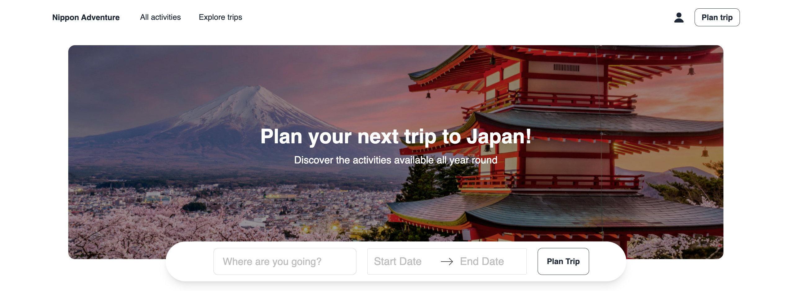

# Nippon Adventure - Frontend

# Description

Nippon Adventure is a React-powered web-app that provides inspiration and planning tools to help you plan your next trip to Japan. This repository includes the code for the frontend, you can find the backend code [here](https://github.com/japan-lovers/japan-planner-backend).

## How it works

Once you know the dates you'll be in Japan, you can create a trip adding both the dates and the destinations you'll be visiting. You can browse the selection of activities we have available and find ideas to add to your trip plan.

In your trip page, you can give it a custom name and drag and drop activities to your calendar as you wish.

# Demo

Plan your next trip to Japan with [Nippon Adventure](https://nippon-adventure.netlify.app/)!
